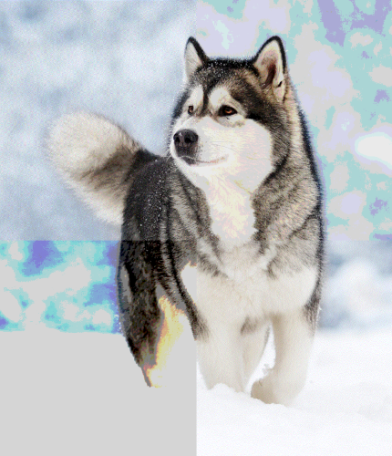
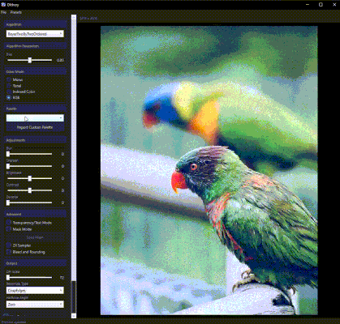
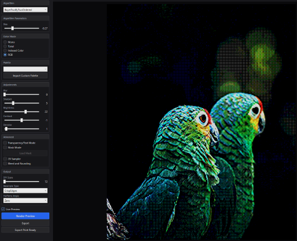

# Dithery

A standalone desktop application for professional-grade image dithering, featuring 39 algorithms, real-time preview, animation support, and print-ready exports. Built as a full-featured alternative to the Dithertone Pro Photoshop plugin — no Photoshop required.

<!-- GIF 1: Open an image, switch between a few algorithms (e.g. Floyd-Steinberg → Bayer 8x8 → Halftone) to show the real-time preview updating. ~10 seconds. -->

## Features

### 39 Dithering Algorithms

Choose from a wide range of classic and modern dithering techniques across five categories:

| Category | Algorithms |
|---|---|
| **Diffusion** | Floyd-Steinberg, Atkinson, Burkes, Jarvis-Judice-Ninke, Sierra (3-Row, 2-Row, Lite), Stucki, Stevenson-Arce |
| **Ordered** | Bayer 2×2 / 4×4 / 8×8 / 16×16, Blue Noise, Cross-Hatch Left & Right, Smile 16×16 |
| **Halftone** | Classic Halftone, Six-Color Halftone, Cluster Dot, Cross-Hatch Halftone |
| **Modulation** | Row (Light/Medium/Heavy), Grid, Horizontal, Vertical, Bi-Thread, Bit Slash, Bitewave, CRT Wave, Light Variant, Heavy Variant, Wave Variant |
| **Other** | Random, Threshold, Glitch, Native Diffusion, Index Animation |

Every algorithm exposes its own tunable parameters so you can dial in the exact look you want:

| Parameter | Applies To | Range |
|---|---|---|
| Spread | Error diffusion algorithms | 0.0–1.0 |
| Intensity | Modulation algorithms | 0.05–1.0 |
| Bias | Ordered / Bayer dithering | -0.5–0.5 |
| Cell Size | Halftone algorithms | 4–32 px |
| Halftone Contrast | Halftone algorithms | 0.5–2.0 |
| Threshold Level | Threshold dither | 0–255 |
| Random Amount | Random dither | 0.0–1.0 |
| Max Shift | Glitch modulation | 1–50 px |

<!-- IMAGE 1: A side-by-side or grid showing the same source image dithered with 3-4 visually distinct algorithms (e.g. Floyd-Steinberg, Bayer 8x8, Halftone, CRT Wave). Crop tightly to highlight the pattern differences. -->

### Four Color Modes

- **Mono** — Pure black and white
- **Tonal** — Grayscale with three-point color grading (shadows, midtones, highlights)
- **Indexed Color** — Custom palette with up to 64 colors, click-to-edit swatches
- **RGB** — Full-color dithering with auto-extracted or hand-picked palettes

<!-- GIF 2: Switch between color modes on the same image — Mono → Tonal (tweak the grading colors) → Indexed with a Retro C64 palette. ~10 seconds. -->

### Pre-Processing

Fine-tune your image before dithering with real-time sliders:

- **Blur** — Gaussian smoothing
- **Sharpen** — Edge enhancement
- **Denoise** — Noise reduction
- **Brightness / Contrast** — Tonal adjustments

### Advanced Controls

- **Live Preview** — Toggle real-time preview with automatic debouncing
- **2X Sampler** — Process at double resolution, then downscale for sharper results
- **Mask Mode** — Load a mask image to apply dithering selectively to specific regions
- **Transparency Mode** — Preserve alpha channels during processing
- **Bleed & Rounding** — Edge softening toggle
- **DPI Scaling** — 72–300 DPI output resolution
- **Resampling** — Crisp Edges (nearest-neighbor) or Rounded Feel (bicubic)
- **Halftone Angle** — 0°, 22.5°, or 45° rotation

<!-- IMAGE 2: Show the left sidebar with sliders adjusted (some non-zero values) and a dithered image in the preview area. Good way to show the full UI layout and dark theme. -->

### Animation & GIF Support

Load animated GIFs and apply dithering uniformly across all frames. Frame timing is preserved, and batch processing runs in parallel for speed.

<!-- GIF 3: Load an animated GIF, apply a dithering algorithm, and show the animated preview playing back. ~8 seconds. -->

### Palettes & Presets

- **3 built-in palettes** — Retro (C64), Pastel, and Vibrant
- **Custom palettes** — Extract colors from any image, edit individual swatches, import/export as JSON
- **Preset system** — Save and load your full configuration (algorithm, color mode, parameters, palette, and all adjustments) as named presets

<!-- IMAGE 3: Show the indexed color mode with a custom palette loaded — the color swatch grid visible in the sidebar alongside the dithered result. -->

### Export Options

- **PNG** — Full-resolution dithered output with alpha preservation
- **Animated GIF** — Re-exported with original frame timing
- **Print-Ready Color Separations** — CMYK and RGB channel separation output for professional screenprinting
- **Palette Swatches** — Visual color grid export

### Auto-Updates

Dithery checks for updates automatically on launch. When a new version is available, a notification bar appears with a one-click update button and download progress.

## Installation

1. Download the latest installer from the [Releases](https://github.com/Kwanzi-Studios/Dithery-release/releases) page
2. Run the installer — it will prompt you to choose an install location
3. Launch Dithery from the Start Menu or install directory

### Requirements

- Windows 10 or later

## Tech Stack

- **C# / .NET 10.0** — WPF desktop application
- **SixLabors.ImageSharp** — Pixel-level image processing
- **CommunityToolkit.Mvvm** — MVVM architecture
- **Velopack** — Auto-update framework
- **Inno Setup** — Installer

## License

All rights reserved. See [LICENSE](LICENSE) for details.
